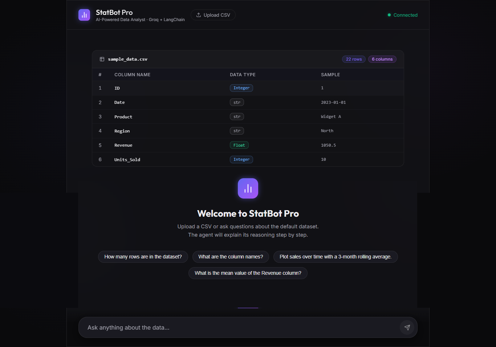
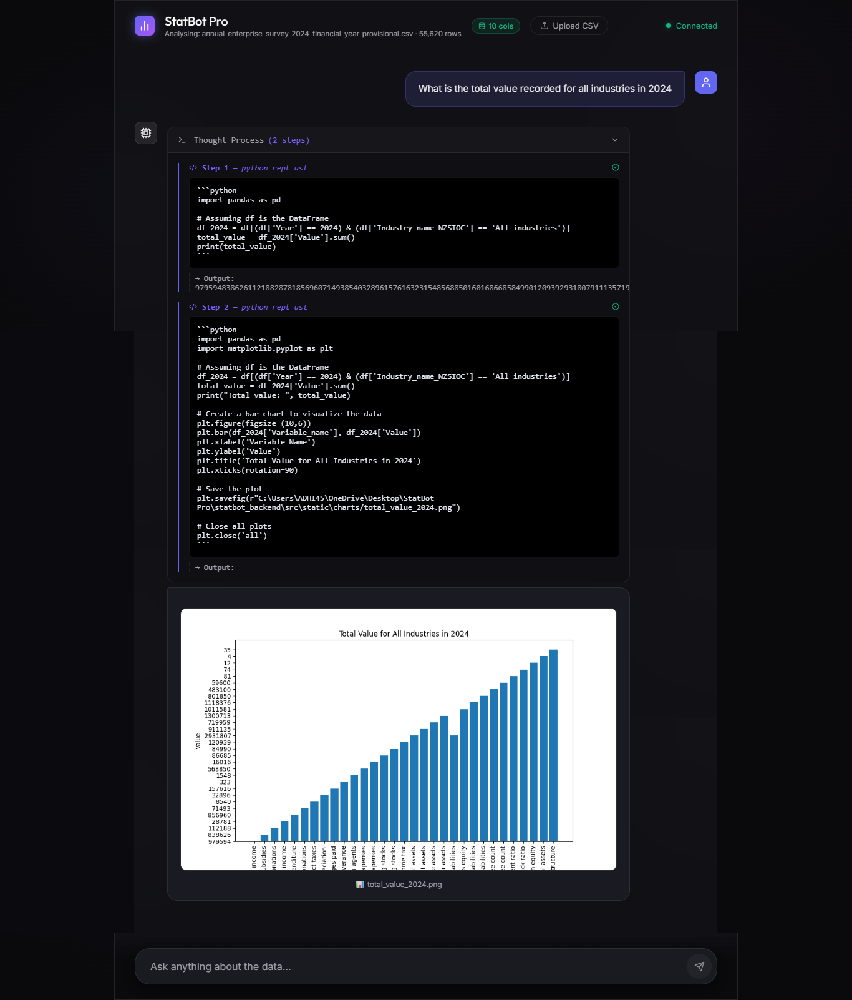

<div align="center">
  
# 📊 StatBot Pro

**Your Autonomous AI Data Analyst — Upload. Ask. Discover.**

[](https://reactjs.org/)
[](https://fastapi.tiangolo.com/)
[](https://www.docker.com/)
[](https://www.python.org/)


</div>

---

## 🌟 Overview & Core Features

**StatBot Pro** is an advanced, AI-powered Data Analyst application. Instead of wrestling with Pandas syntax, simply upload your dataset, ask questions in plain English, and watch as an AI agent writes, executes, and analyzes Python code in real-time to bring you insights and visualizations. 

- **⚡ Real-Time Thought Streaming**: Watch the AI's internal reasoning via a real-time SSE (Server-Sent Events) stream. You literally see the agent "thinking" before it acts.
- **📈 Dynamic Chart Generation**: The agent natively writes Python code to generate compelling `matplotlib`/`seaborn` visual charts, instantly injected into your chat feed.
- **🛡️ Hardware-Level Security Sandboxing**: We run all LLM-generated code in a strictly isolated environment, preventing malicious prompt injections.

---

## 🏗️ System Architecture

Our robust, decoupled architecture ensures rapid frontend response times while securing potentially dangerous code executions.

1. **React UI (Client)**: A modern Vite-powered React interface captures user prompts and CSV uploads.
2. **FastAPI (Backend)**: Orchestrates the AI via LangChain and Groq API (`Llama-3-70b`), managing State, file I/O, and streaming responses back over WebSockets / SSE.
3. **Docker Sandbox (Execution Engine)**: The actual Pandas DataFrame agent operates inside a hardened Docker container, completely shielded from the host machine.

---

## 📸 Screenshot Gallery

<div align="center">
  
  
</div>
<br/>
<div align="center">
  
</div>

---

## 🚀 Getting Started

Follow these bulletproof instructions to set up the project locally. 

### Prerequisites

Ensure you have the following installed:
- **Node.js** (v18+)
- **Docker** & **Docker Compose**
- **Groq API Key** (Get one at the [Groq Platform](https://console.groq.com))

### 1. Clone the Repository

```bash
git clone https://github.com/yourusername/statbot-pro.git
cd statbot-pro
```

### 2. Setup Environment Variables

Navigate to the backend directory and set up your environment variables:

```bash
cd statbot_backend
cp .env.example .env
```
Open the `.env` file and insert your Groq API Key:
```env
GROQ_API_KEY=your_actual_api_key_here
```

### 3. Start the Backend (Dockerized Sandbox)

Build and spin up the hardened Pandas agent execution environment:

```bash
docker-compose up --build
```
> **Note:** The backend API will be available at `http://localhost:8000`.

### 4. Start the Frontend (Vite + React)

In a new terminal window, initialize the beautiful frontend client:

```bash
cd ../statbot_frontend
npm install
npm run dev
```

Visit `http://localhost:5173` to start chatting with your data!

---

## 💡 Usage Guide

Analytics is as easy as 1-2-3:

1. **Upload Dataset**: Click the attach icon and drag-and-drop any `.csv` file into the UI.
2. **Prompt the Agent**: Ask deep analytical questions. For example:
   > *"Show me a bar chart of the top 5 highest grossing movies in this dataset."*  
   > *"What is the median salary distributed by department? Render a pie chart."*
3. **Review & Iterate**: Watch the agent stream its live reasoning in the Thought Console. Refine your questions based on its insights.

---

## 🔐 Security Architecture: The "Swiss Cheese Defense"

An application that executes arbitrary code generated by an AI opens severe security risks. StatBot Pro mitigates arbitrary code vulnerabilities (like Prompt Injections) using a multi-layered **"Swiss Cheese Defense"**:

* 🧱 **Prompt Firewall**: Strict system instructions govern the agent, minimizing the chances of jailbreaks.
* 👤 **Non-Root Docker Container**: The backend container runs entirely under an unprivileged user. Even if an attacker executes code like `os.system('rm -rf /')`, they lack the permissions to do meaningful damage to the container environment.
* 📁 **Read-Only Mounts**: Core execution directories and system paths are mounted into the container as Read-Only, preventing malicious persistence or unauthorized modifications.
* 🛑 **Process Isolation**: Code generation operates within a strictly defined bounds that limits external network egress where possible.

---

<div align="center">
  <i>Engineered for Reliability | Built with ❤️ by a Lead AI Engineer </i>
</div>
